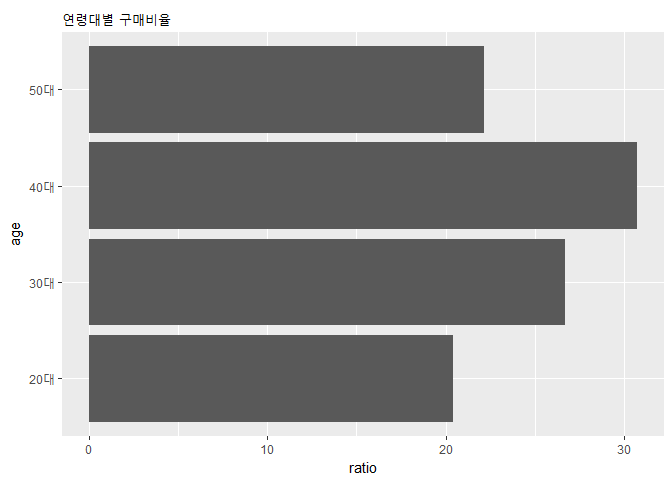
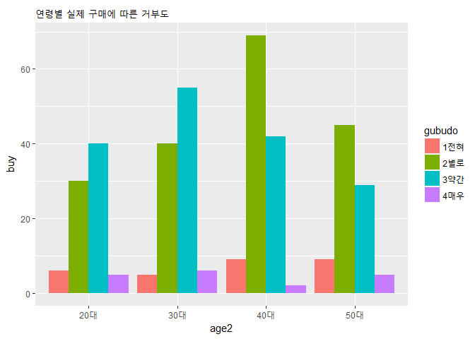
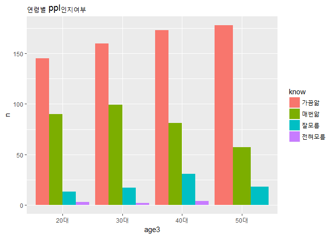

PPL 광고의 효과
================

초록
====

요약
----

ppl의 효과를 그 물건의 구매여부로 보고 연령대별 구매 비율을 먼저 구했다. 40, 30, 50, 20의 순으로 높았는데, 왜 이런 순서로 나왔는지 알아보기 위해 **연령대별 평균소득**과 **구매한 사람들의 ppl 거부도**, **ppl 인지여부**라는 세 가지 변수로 나누어 추가 분석하였다. 연령대별 평균소득은 ppl 데이터에서 분석하는 것이 한계가 있어 같은 년도에 실시된 분석중 연령대와 소득을 알 수 있는 파일을 이용해 구하였다. 세 가지 변수가 어떻게 영향을 미쳤는지에 관한 결론은 데이터 분석과 함께 자세히 설명하겠다.

분석 주제
---------

오늘날 미디어는 우리 일상에 깊게 녹아있는 존재가 되어 미디어 없이 살아가는 건 거의 불가능한 시대가 되었다. 그러한 미디어의 가장 큰 생산 원천은 바로 **광고**이다. 미디어는 광고를 통해 들어오는 수익으로 제작비를 마련하기 때문이다. 이러한 이유로 우리가 쉽게 접하는 드라마 또는 예능과 같은 미디어 프로그램에서 **ppl**을 쉽게 발견할 수 있게 되었다. ppl이란 영화나 드라마 속에 소품으로 등장하는 상품을 일컫는 것으로 브랜드명이 보이는 상품뿐만 아니라 이미지, 명칭 등을 노출시켜 관객들에게 홍보하는 일종의 광고마케팅 전략이다. 그렇기 때문에 ppl도 무작정 할 것이 아닌 철저한 타겟층 분석과 그에 걸맞는 홍보방법을 찾아야만 가장 효과적인 광고효과를 얻어낼 수 있을 것이다. 그래서 우리는 이 분석을 통해 어떤 연령층에 가장 ppl이 효과적인지와 그 이유에 대해 살펴봄으로써 ppl을 활용하는데 있어 지표로 활용되는 기반이 되기를 기대해본다.

데이터 선정
===========

데이터는 **시청자의 ppl인식과 광고효과**데이터와 **19차 한국노동자 패널조사(2016)**데이터를 이용하였다. 우선 첫번째 데이터를 선정한 이유는 연령대별로 ppl을 통해 물건을 구매한 비율을 구할 수 있는 문항이 있기 때문이었다. 이와 더불어 사람들의 ppl인식을 측정할 수 있는 다양한 문항이 있어 활용가치가 있었다. 두번째 데이터를 선정한 이유는 한국 국민의 정확한 소득분위를 알기 위함이었다. 첫번째 데이터가 조사된 시점의 한국 국민들의 연령별 소득분위가 ppl을 통한 구매력에 영향을 미치는지에 대한 궁금증이 생겼기 때문이다.

첫번째 데이터의 출처는 공공데이터포털이다.\[<http://me2.do/xlzadLNG>\] 데이터는 가공되지 않은 Raw Data이며 총 26개 3파트로 문항이 구성되어 있다. 두번째 데이터의 출처는 한국노동패널조사 사이트이다.\[<https://www.kli.re.kr/klips/index.do>\] 마찬가지로 가공되지 않은 Raw Data이며 총 24개 파트로 문항이 구성되어 있다.

분석- 연령대별 구매비율
-----------------------

``` r
###패키지 장착

library(foreign) # spss 파일 불러오기
library(ggplot2)
library(readxl)
library(dplyr) 

###데이터 파일 불러오기
raw_ppl <- read_excel("media_ppl_.xlsx")

###복사본 만들기
ppl_media <- raw_ppl

###변수명 변경하기
ppl_media <- rename(ppl_media,
                    age = SQ2,
                    buy = Q12)

###필요한 변수만 추출하기
ppl_media <- ppl_media %>% select(age, buy)

###이상치, 결측치 확인
table(is.na(ppl_media))
```

    ## 
    ## FALSE 
    ##  2142

``` r
table(ppl_media$age)
```

    ## 
    ##   2   3   4   5 
    ## 251 278 289 253

``` r
table(ppl_media$buy)
```

    ## 
    ##   1   2 
    ## 397 674

``` r
# 이상치, 결측치 없으므로 넘어감

###연령 항목 이름 부여
ppl_media$age <- ifelse(ppl_media$age == 2, "20대", 
                        ifelse(ppl_media$age == 3, "30대", 
                               ifelse(ppl_media$age == 4, "40대", "50대")))

###구매 여부 이름 부여
ppl_media$buy <- ifelse(ppl_media$buy==1,"T","F")

###연령대별 구매 비율
ppl_media_age <-  
  ppl_media %>% 
  filter(buy == "T") %>%
  group_by(age) %>%
  summarise(n=n()) %>% 
  mutate(ratio =(n/397)*100) %>% 
  arrange(desc(ratio))

ppl_media_age
```

    ## # A tibble: 4 x 3
    ##   age       n ratio
    ##   <chr> <int> <dbl>
    ## 1 40대    122  30.7
    ## 2 30대    106  26.7
    ## 3 50대     88  22.2
    ## 4 20대     81  20.4

``` r
###연령별 그래프
ggplot(data = ppl_media_age, aes(x = age, y = ratio)) + geom_col() + coord_flip()+ggtitle("연령대별 구매비율")
```



40, 30, 50, 20대 순으로 구매비율이 나타났다. 왜 이런 결과가 나왔는지 연령대별 평균소득, ppl 거부도, ppl 인지여부를 통해 알아보려고 한다.

분석(1)- 연령대별 평균소득
--------------------------

``` r
###데이터 파일 불러오기
raw_income <- read.spss(file="klips19p.sav",
                        to.data.frame = T )

##복사본 만들기##
income_data <- raw_income

##이상치, 결측치 확인##
table(is.na(income_data$p190107)) #연령
```

    ## 
    ## FALSE 
    ## 14202

``` r
table(is.na(income_data$p191703))#소득
```

    ## 
    ## FALSE  TRUE 
    ##  8026  6176

``` r
summary(income_data$p190107)
```

    ##    Min. 1st Qu.  Median    Mean 3rd Qu.    Max. 
    ##   15.00   36.00   48.00   48.95   63.00  101.00

``` r
summary(income_data$p191703)
```

    ##    Min. 1st Qu.  Median    Mean 3rd Qu.    Max.    NA's 
    ##      -1    1440    2400    2884    3600   42000    6176

소득에서 결측치와 이상치가 발견되었다. 소득이 -1이라는 항목만 결측처리하고 filter를 사용해 결측치 없는 것만 사용할 것이다.

``` r
###변수명 변경하기(소득)
income_data <- rename(income_data,
                      income=p191703) #소득

###이상치 결측 처리(소득)
income_data$income <- ifelse(income_data$income==-1,NA,income_data$income)

###연령 이름 부여
income_data$age_2 <- ifelse(income_data$p190107<20, "20대미만",
                          ifelse(income_data$p190107<30, "20대",
                                 ifelse(income_data$p190107<40, "30대",
                                        ifelse(income_data$p190107<50, "40대",
                                               ifelse(income_data$p190107<60, "50대","60대이상")))))

# ppl의 연령을 age 변수로 지정했기 때문에 소득분위 구별 연령은 age_2로 설정

###필요한 변수 추출
age_income <- income_data %>%
  filter(age_2 %in% c("20대","30대","40대","50대")) %>% 
  select(age_2,income)

###연령대별 평균소득
age_income_mean <- age_income %>% 
  filter(!is.na(income)) %>% 
  group_by(age_2) %>% 
  summarise(mean_income=mean(income)) %>% 
  arrange(desc(mean_income))

age_income_mean  #단위: 만원
```

    ## # A tibble: 4 x 2
    ##   age_2 mean_income
    ##   <chr>       <dbl>
    ## 1 40대        3552.
    ## 2 50대        3226.
    ## 3 30대        3134.
    ## 4 20대        1854.

분석(2)- 연령별 구매한 사람들의 ppl 거부도
------------------------------------------

``` r
###복사본 만들기
ppl_media2 <- raw_ppl

###변수명 변경
ppl_media2 <- rename(ppl_media2,
                     age2 = SQ2,
                     gubudo = Q3,
                     buy = Q12)
# 연령을 age2로하는 이유는 앞의 분석의 연령과 헷갈리지 않게 하기 위해서이다.

###필요한 변수 추출
ppl_media <- ppl_media2 %>% select(age2,gubudo,buy)
ppl_media
```

    ## # A tibble: 1,071 x 3
    ##     age2 gubudo   buy
    ##    <dbl>  <dbl> <dbl>
    ##  1    4.     2.    1.
    ##  2    3.     3.    2.
    ##  3    2.     3.    2.
    ##  4    2.     3.    2.
    ##  5    5.     3.    2.
    ##  6    3.     2.    1.
    ##  7    3.     3.    2.
    ##  8    4.     3.    1.
    ##  9    4.     4.    2.
    ## 10    3.     3.    2.
    ## # ... with 1,061 more rows

``` r
###결측치, 이상치 확인
table(is.na(ppl_media))
```

    ## 
    ## FALSE 
    ##  3213

``` r
table(ppl_media$age2)
```

    ## 
    ##   2   3   4   5 
    ## 251 278 289 253

``` r
table(ppl_media$gubudo)
```

    ## 
    ##   1   2   3   4 
    ##  52 430 525  64

``` r
table(ppl_media$buy)
```

    ## 
    ##   1   2 
    ## 397 674

``` r
#결측치, 이상치 모두 없으므로 넘어감


###연령 항목 이름 부여
ppl_media$age2 <- ifelse(ppl_media$age2 == 2, "20대", 
                        ifelse(ppl_media$age2 == 3, "30대", 
                               ifelse(ppl_media$age2 == 4, "40대", "50대")))

###실제 구매 항목 이름 부여
ppl_media$buy <- ifelse(ppl_media$buy==1,"T","F")

###거부하는 정도 항목 이름 부여
ppl_media$gubudo <- ifelse(ppl_media$gubudo==1, "1전혀", 
                           ifelse(ppl_media$gubudo==2, "2별로",
                                  ifelse(ppl_media$gubudo==3, "3약간", "4매우")))

###연령별 실제 구매에 따른 거부도
age_buy <- ppl_media %>% 
  filter(buy=="T") %>% 
  group_by(age2,gubudo) %>% 
  summarise(buy=n()) %>% arrange(gubudo,buy)

age_buy
```

    ## # A tibble: 16 x 3
    ## # Groups:   age2 [4]
    ##    age2  gubudo   buy
    ##    <chr> <chr>  <int>
    ##  1 30대  1전혀      5
    ##  2 20대  1전혀      6
    ##  3 40대  1전혀      9
    ##  4 50대  1전혀      9
    ##  5 20대  2별로     30
    ##  6 30대  2별로     40
    ##  7 50대  2별로     45
    ##  8 40대  2별로     69
    ##  9 50대  3약간     29
    ## 10 20대  3약간     40
    ## 11 40대  3약간     42
    ## 12 30대  3약간     55
    ## 13 40대  4매우      2
    ## 14 20대  4매우      5
    ## 15 50대  4매우      5
    ## 16 30대  4매우      6

``` r
###연령별 실제 구매에 따른 거부도 그래프
ggplot(data = age_buy, aes(x= age2, y= buy, fill = gubudo)) + geom_col(position = "dodge")+ggtitle("연령별 실제 구매에 따른 거부도")
```



분석(3)- 연령별 ppl 인지여부
----------------------------

``` r
###복사본 만들기
ppl_media3 <- raw_ppl

###필요한 변수추출
ppl_media <- ppl_media3 %>% select(SQ2,Q2)

###이상치, 결측치 확인
table(is.na(ppl_media$SQ2)) #연령
```

    ## 
    ## FALSE 
    ##  1071

``` r
table(is.na(ppl_media$Q2))  #인지여부
```

    ## 
    ## FALSE 
    ##  1071

``` r
table(ppl_media$SQ2)
```

    ## 
    ##   2   3   4   5 
    ## 251 278 289 253

``` r
table(ppl_media$Q2)
```

    ## 
    ##   1   2   3   4 
    ##   9  79 656 327

``` r
# 이상치, 결측치 없으므로 다음단계로 넘어감

###연령 항목 이름 부여
ppl_media$age3 <- ifelse(ppl_media$SQ2 == 2, "20대", 
                        ifelse(ppl_media$SQ2 == 3, "30대", 
                               ifelse(ppl_media$SQ2 == 4, "40대", "50대")))


###ppl 인지여부 항목 변수 추가
ppl_media$know <- ifelse(ppl_media$Q2==1,"전혀모름",
                         ifelse(ppl_media$Q2==2,"잘모름",
                                ifelse(ppl_media$Q2==3,"가끔앎","매번앎")))
table(ppl_media$know)
```

    ## 
    ##   가끔앎   매번앎   잘모름 전혀모름 
    ##      656      327       79        9

``` r
###연령별 ppl 인지여부 분석
age_know <- ppl_media %>% group_by(age3, know) %>% summarise(n=n())

age_know
```

    ## # A tibble: 15 x 3
    ## # Groups:   age3 [?]
    ##    age3  know         n
    ##    <chr> <chr>    <int>
    ##  1 20대  가끔앎     145
    ##  2 20대  매번앎      90
    ##  3 20대  잘모름      13
    ##  4 20대  전혀모름     3
    ##  5 30대  가끔앎     160
    ##  6 30대  매번앎      99
    ##  7 30대  잘모름      17
    ##  8 30대  전혀모름     2
    ##  9 40대  가끔앎     173
    ## 10 40대  매번앎      81
    ## 11 40대  잘모름      31
    ## 12 40대  전혀모름     4
    ## 13 50대  가끔앎     178
    ## 14 50대  매번앎      57
    ## 15 50대  잘모름      18

``` r
###tidyr 패키지 이용해서 보기좋게 만들기
library(tidyr)
ak <- spread(age_know,know,n)
ak
```

    ## # A tibble: 4 x 5
    ## # Groups:   age3 [4]
    ##   age3  가끔앎 매번앎 잘모름 전혀모름
    ##   <chr>  <int>  <int>  <int>    <int>
    ## 1 20대     145     90     13        3
    ## 2 30대     160     99     17        2
    ## 3 40대     173     81     31        4
    ## 4 50대     178     57     18       NA

``` r
##연령별 ppl 인지여부 그래프##
ggplot(data = age_know, aes(x= age3, y= n, fill = know)) + geom_col(position = "dodge")+ggtitle("연령별 ppl인지여부")
```



**40대**가 구매비율이 가장 높았다(1위). 이는 연령대별 평균소득에서 40대가 1위이고, 거부도도 '전혀없음', 과 '별로'에서 볼 수 있듯이 40대의 ppl거부도를 찾아보기 힘든것이 영향을 끼친 것으로 보인다. 또한 인지여부도 모른다에 속하는 사람이 17명으로 나머지 다수(254명)에 속하는 사람들이 구매비율에 영향을 주었을 것으로 추측된다.

**30대**는 구매비율이 2위이다. 30대의 소득은 3위로 낮은편이지만, 구매비율은 높은편이다. 인지도는 ppl인지 안다는 30대들이 대다수였다. 즉, ppl에 대한 거부도는 있지만 해당 물건에 대한 거부도는 아닌 것으로 미루어 짐작된다.

**50대**는 평균소득(2위)이 높은 편이지만 구매비율은 3위였다. 인지여부는 가끔아는 것(1위) 말고 그외의 나머지 50대의 절반에 가까운 사람들은 잘 알아차리지 못하는 편이었다. ppl 거부도도 모두 낮은 수치를 보였다. ppl 인지를 잘 못하니 거부도도 낮게 나오는 것이 당연하다. 결국 이러한 영향이 50대의 구매비율을 낮춘것을 보인다.

**20대**는 구매비율에서 4위를 차지했다. 평균소득이 20대가 제일 낮았고, 거부도도 낮은 편이었다. 인지여부는 매번 안다는 사람(90명)을 제외하면 인지여부가 대체로 제일 낮은것과 평균소득이 구매비율에 영향을 준 것으로 생각된다.

논의
----

ppl 상품의 구매비율 결과를 세 가지 변수를 통해 분석해 보았다. 연령대를 20대부터 50대까지로 한정지었는데, 백세시대인 현재 시대를 고려하여 연령대를 늘려서 분석한다면 더욱더 다채로운 분석이 될 것이다. 또한 거부도와 인식여부를 알아보는 문항의 답이 전혀아님, 아님, 약간 그렇다, 매우 그렇다,로 나뉘어 있었는데 이점에서 어디부터 어디까지를 기준으로 나누어 비교해야 하는지가 애매했었다. 더 나아가 추후에는 어떤 상품이 누구에게 가장 효과적인지, 또는 어떤 프로그램에서 나오는 ppl이 어떻게 효과적인지 등 더 다양한 분석도 가능할 것이라는 예측이 된다.
